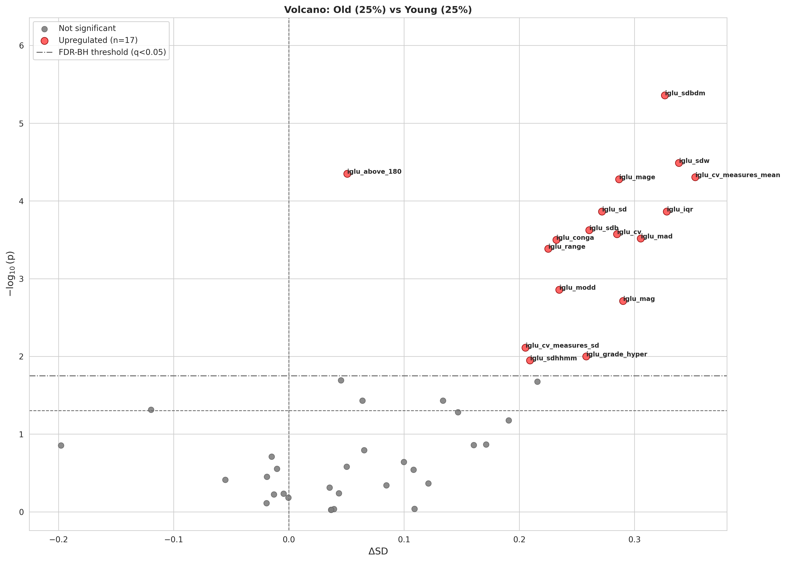

# Biological Age Analysis Library

A library for analyzing biological age predictions against biomarkers from body systems. Compares subjects with "young" vs "old" predicted ages within age-matched bins using volcano plots.

## Environment Setup

Create a `.env` file in the project root with:

```bash
BODY_SYSTEMS=/path/to/body_systems_data
```

This path should contain CSV files for each body system (e.g., `frailty.csv`, `glycemic_status.csv`) and a `body_systems_description/` folder with metadata.

## Quick Start

```python
import pandas as pd
from biological_age_lib import analyze_biological_age, BiologicalAgeConfig

# Load predictions - must have MultiIndex (RegistrationCode, research_stage)
# and columns: real_age, predicted_age
predictions_df = pd.read_csv('predictions.csv', index_col=['RegistrationCode', 'research_stage'])

# Configure analysis
config = BiologicalAgeConfig(
    min_age_cutoff=40,           # Remove subjects under 40
    percentile=0.25,             # Compare top/bottom 25%
    gender_split=True,           # Analyze by gender
)

# Run analysis
results = analyze_biological_age(
    predictions_df,
    labels=['frailty', 'glycemic_status'],  # Body systems to analyze
    config=config,
    save_dir='/path/to/output'
)
```

## Input Format

Your predictions DataFrame must have:
- **MultiIndex**: `(RegistrationCode, research_stage)`
- **Columns**: `real_age`, `predicted_age`

```
                                    real_age  predicted_age
RegistrationCode  research_stage                          
10K_12345         baseline            55.2          57.8
10K_12345         02_00_visit         56.2          58.1
10K_67890         baseline            42.1          40.5
```

## Label Formats

Labels can be specified in three ways:

```python
# 1. Body system name (loads all columns from that system)
labels = ['frailty', 'glycemic_status']

# 2. Specific columns from any system
labels = [
    {'custom_frailty': ['hand_grip_right', 'hand_grip_left', 'walking_speed']},
    {'inflammation': ['TNF', 'IL6', 'CRP']},
]

# 3. Your own external CSV file
labels = [
    {'my_data': '/path/to/custom_data.csv'},
]
```

### Using Your Own CSV Files

You can analyze any custom features by providing a CSV file. The CSV must have:
- **MultiIndex**: `(RegistrationCode, research_stage)` as the first two columns
- **Feature columns**: Any numeric columns you want to analyze

Example CSV structure:
```
RegistrationCode,research_stage,my_feature_1,my_feature_2,my_feature_3
10K_12345,baseline,1.5,0.8,2.3
10K_12345,02_00_visit,1.6,0.9,2.1
10K_67890,baseline,0.9,1.2,1.8
```

Load it with:
```python
labels = [
    {'proteomics_custom': '/home/user/my_proteomics.csv'},
    {'metabolomics': '/home/user/my_metabolomics.csv'},
    'frailty',  # Can mix with body system names
]
```

The library will automatically align your data to the predictions index using closest research_stage matching.

## Configuration Options

```python
BiologicalAgeConfig(
    # Age binning
    min_age=40,                  # Min age for bins (auto-detect if None)
    max_age=72,                  # Max age for bins (auto-detect if None)
    bin_width=4,                 # Years per age bin
    percentile=0.25,             # Top/bottom fraction (0.25 = 25%)
    
    # Data filtering
    min_age_cutoff=40,           # Remove subjects under this age
    keep_first_visit_only=True,  # Keep only first visit per subject
    
    # Analysis
    gender_split=True,           # Run separate analysis per gender
    alpha=0.05,                  # FDR significance threshold
    run_fdr_on='per_system',     # 'per_system' or 'all'
    
    # Custom plot titles (use placeholders below)
    scatter_title='My Study: Predicted vs True Age',
    volcano_title='Volcano: {label2} vs {label1}',
    residuals_title='Prediction Residuals',
    error_dist_title='Absolute Error Distribution',
    
    # Visualization
    volcano_figsize=(14, 10),
    scatter_figsize=(12, 10),
    volcano_label_fontsize=8,
    upregulated_color='#FF5252',    # Red for higher in "old" group
    downregulated_color='#4CAF50',  # Green for lower in "old" group
)
```

### Title Placeholders

You can use these placeholders in custom titles:
- `{gender}` - Current gender group (all, male, female)
- `{n}` - Total sample size
- `{n1}`, `{n2}` - Sample sizes for each group
- `{label1}`, `{label2}` - Group labels (e.g., "Young (25%)", "Old (25%)")

## Output Structure

```
output_dir/
├── filtered_predictions.csv     # Filtered input data
├── prediction_metrics.csv       # MAE, RMSE, R², correlation
├── bin_summary.csv              # Top/bottom group counts
├── figures/
│   ├── predictions_all_main.png
│   ├── predictions_male_main.png
│   └── predictions_female_main.png
└── volcano/
    ├── frailty/
    │   ├── volcano_all.png
    │   ├── volcano_male.png
    │   └── volcano_female.png
    └── glycemic_status/
        ├── volcano_all.png
        ├── volcano_male.png
        └── volcano_female.png
```

## Example Volcano Plot



This volcano plot compares glycemic biomarkers between males predicted as "old" (top 25% within age bin) vs "young" (bottom 25%). Significant features after FDR correction are highlighted in red (higher in "old" group).

**Interpretation:**
- **X-axis (ΔSD)**: Standardized effect size between groups
- **Y-axis (-log₁₀ p)**: Statistical significance
- **Red points**: Significant after FDR correction (q < 0.05)
- Features in the upper-right are elevated in the "biologically older" group

## Statistical Methods

See [STATISTICS.md](STATISTICS.md) for a detailed explanation of:
- Age-matched binning strategy
- Mann-Whitney U tests
- FDR correction (Benjamini-Hochberg)
- Effect size interpretation (ΔSD)
- Volcano plot visualization

## Complete Example

See `test_run.py` for a complete working example with all configuration options.
